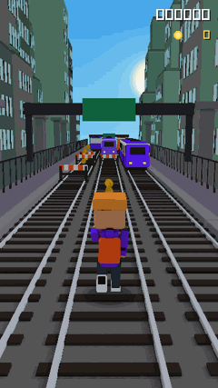
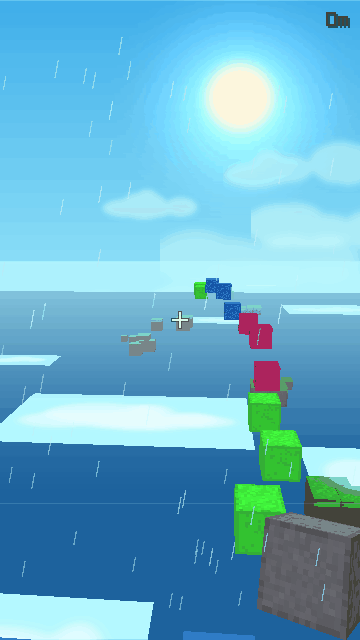
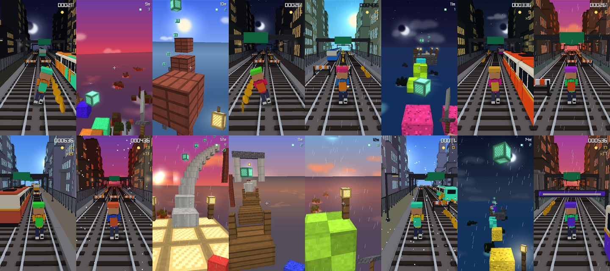

# claude-brainrot

*Subway Surfers while CC is thinking.*

A narrow strip of generated gameplay that appears beside your Claude Code
window while it is thinking, and gets out of the way when it stops.

No footage, no downloads. Every world is generated at runtime from a seed that
has never been used before and never will be again — rendered in real 3D with
models built by the Blender scripts in this repository.

<p align="center">
  
  
</p>

```
  you hit enter
        │
        ▼
  UserPromptSubmit hook ──UDP──► daemon ──► new seed ──► new world ──► fade in
        ...
  Stop hook ────────────────────► daemon ──────────────────────────► fade out
```

## What plays

Two scenes, chosen per run from the run's seed.

| Scene | What it is |
|---|---|
| `runner` | The classic: three locked lanes, a chase camera, subway cars with per-run liveries, hazard barriers, gantries, coin arcs, and a city canyon whose windows light up at night. An autopilot follows a corridor that is guaranteed reachable *by construction* and live-dodges oncoming trains. |
| `parkour` | First-person infinite parkour, the way the actual background reels do it: one flawless sprint-jump per beat, high over an ocean of wooded islands, reef shallows and drifting cloud shelves. The course arrives in set-pieces — a staircase, a plank causeway, a spiral round a brick tower, a gate you run *through*, a long fall onto a lantern-lit platform — each built from one family of materials. Orbs hang on the exact arc of the jump that reaches them, so every one laid down is collected. Something is always in your hand: a block, a sword, a pickaxe, a torch. |

Every run also generates its own palette, time of day, weather and sky — a sun
or crescent moon with a real glow, parallax clouds, a starfield that thins
toward the horizon, rain or snow. The same scene twice in a row does not look
the same.

<p align="center">
  
</p>

## How it looks like that

The renderer is [raylib](https://www.raylib.com/) (a ~2 MB wheel); the models
are glTF files **built by scripts committed to this repo** (`assets/src/*.py`),
executed under headless Blender. Each asset bakes its lighting — sun, sky
bounce, ambient occlusion — into a grayscale texture, and keeps its colours in
flat named material zones. At runtime every pixel is just

    baked light map  ×  zone colour  ×  distance fog

which is why the daemon can recolour a hoodie or a train livery per seed
without any lighting maths, and why CI screenshots (rendered on a software
rasteriser) match what your GPU shows.

The character is skin-rigged with run, jump and roll clips authored in the same
scripts. The parkour blocks use vanilla Minecraft's actual face-shading
constants (top 1.0, sides 0.8/0.6, bottom 0.5) baked into 16×16 pixel-art
atlases.

Rebuilding the kit after editing a script (needs `pip install bpy`, dev-only):

```bash
python assets/build.py            # everything
python assets/build.py character  # one asset
python assets/preview.py character  # render it for your eyeballs
```

## Install

```bash
pip install claude-brainrot   # or: git clone + pip install -e .
brainrot install              # writes hooks into ~/.claude/settings.json
brainrot run                  # long-lived; leave it running
```

That is the whole setup. Open Claude Code and give it something slow to do.
Check any machine with `brainrot doctor`. Remove with `brainrot uninstall`.

## It belongs to Claude Code, not to your screen

On Windows the overlay is **not** globally always-on-top, and it is not on
screen just because Claude is busy. The hook shim notes which window you
submitted your prompt from — that window *is* your Claude Code — and from
then on:

- **It only appears while you are looking at that window.** Switch to your
  browser and it fades out; switch back and it returns. Nothing known about
  where Claude Code is means it stays hidden, rather than floating over
  everything. (`follow_focus = false` for the always-on behaviour, which is
  what demos and screen recordings want.)
- **It stands beside that window, not on your screen edge.** A screen edge is
  wherever the app keeps its sidebar; the strip goes into the empty gutter on
  the `dock` side of the Claude Code window instead, and *outside* that window
  entirely when the desktop has room. It follows the window if you move it.
- **It rides one z-level above it.** Ownership, so raising your terminal
  raises the strip with it. `attach = "topmost"` restores float-over-all.
- **You can move it.** Hold `ctrl+alt` and drag it wherever you like; where
  you drop it is remembered and still follows the window. Double-click while
  holding the chord to go back to automatic placement. Clicks are caught only
  while that chord is held over the strip — otherwise the mouse falls
  straight through, and focus is never taken either way.

## Try it without Claude Code

```bash
brainrot demo --scene runner              # a normal window, always on
brainrot demo --scene parkour --seed 4712 # replay one specific run
brainrot shoot --scene runner --frames 300 --out shots/  # frames to PNG
brainrot scenes                           # what is registered, and your run count
```

`brainrot ping UserPromptSubmit` and `brainrot ping Stop` drive the real daemon
by hand, which is the fastest way to check show/hide behaviour without waiting
on a real turn.

## Why it does not annoy you

The gap between "Claude is busy" and "put something on screen" is where all the
work is:

- **Short turns never show anything.** Nothing appears until Claude has been
  busy for 1.5s, so quick answers do not make the strip strobe.
- **Nothing flashes.** Once it has appeared it stays for at least 3s, even if
  Claude finishes immediately afterwards.
- **It never takes focus or eats clicks.** The window is click-through and
  cannot be activated, so it does not interrupt typing and you can click
  straight through it.
- **It hides when Claude needs you.** A permission prompt means your attention
  belongs on the terminal.
- **It costs nothing while hidden.** No scene is held, nothing renders, and the
  loop parks on a long sleep.

## Configuration

Optional `config.toml`, next to the run-counter state:

- Linux/macOS: `~/.local/state/claude-brainrot/config.toml`
- Windows: `%APPDATA%\claude-brainrot\config.toml`

Run `brainrot doctor` for the path it is actually reading. On a **Microsoft
Store** Python that is not the path above: the Store redirects `%APPDATA%`
into the package's `LocalCache`, and the copy you can see in Explorer is one
the daemon cannot open at all. The `config` check prints the real one.

```toml
[window]
width = 360
height = 640
dock = "right"     # which side of the Claude Code window to stand on
margin_x = 12      # gap from that side
margin_y = 20      # gap from the top and bottom of that window
anchor_y = 0.0     # 0 = top of it, 1 = bottom of it
monitor = 0        # only used when no host window is known
opacity = 0.88
fps = 60
attach = "host"    # "host" = one level above Claude Code, "topmost" = above all

[behaviour]
grace_seconds = 1.5
min_visible_seconds = 3.0
hide_on_notification = true
follow_focus = true      # on screen only while you are looking at Claude Code
drag_chord = "ctrl+alt"  # hold to drag the strip; "" to disable

[content]
scenes = ["runner", "parkour"]
quality = "high"
```

Any field can also be set with an environment variable:
`BRAINROT_WIDTH`, `BRAINROT_GRACE_SECONDS`, `BRAINROT_SCENES`, and so on.

## Platform support

| | Overlay | Click-through | Attach to Claude Code | Notes |
|---|---|---|---|---|
| Windows | yes | yes | yes | the intended target; no extra deps |
| Linux / macOS | yes | partial | no | undecorated window; fine for development |
| Headless / CI | offscreen | n/a | n/a | software rasteriser, no display needed |

## Development

```bash
pip install -e ".[dev]"
pip install raylib-software --force-reinstall --no-deps  # headless machines/CI
pytest
```

349 tests covering the show/hide state machine, the seeding guarantees, hook
install/uninstall, the real shim end to end, a full daemon driven over UDP,
pixel-identical determinism per seed, and the generation invariants — the
corridor that can never strand the runner, the single-oncoming-train rule and
the live dodge, zero interpenetration over hours of simulated running, no
parkour hop the flight solver cannot fly, self-overlap refusal, the altitude
band, and every orb the parkour generator hangs being collected.

Docs: [`docs/ARCHITECTURE.md`](docs/ARCHITECTURE.md) for how the pieces fit and
why, [`docs/HOOKS.md`](docs/HOOKS.md) for the hook layer specifically.

## License

MIT. Every model ships as output of a script in `assets/src/` — no third-party
assets are included or fetched.
